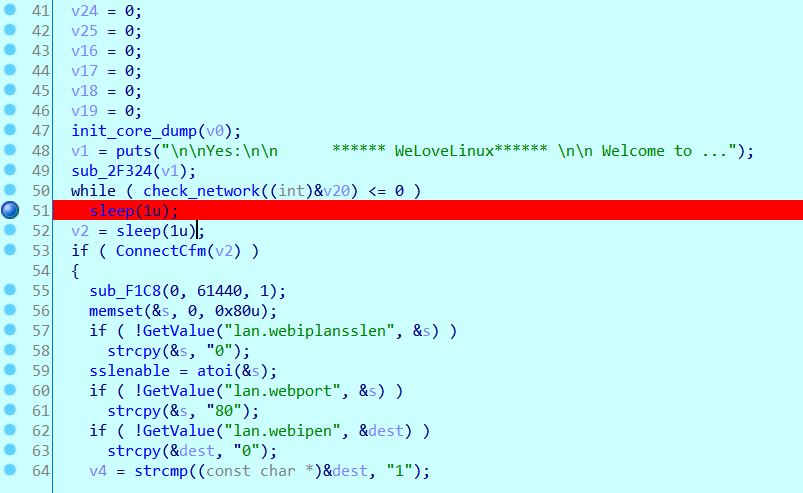
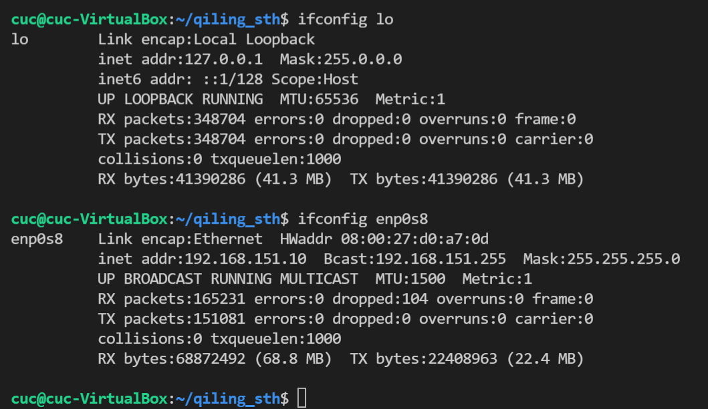

# 使用 Qiling 运行 tenda ac15 
## 环境
```bash
git clone -b dev https://github.com/qilingframework/qiling.git
cd qiling && git submodule update --init --recursive
sudo pip3 install . 
```


## 模拟运行
下载 tenda ac15 的固件
使用 qiling + ida 远程 attach gdbserver 的方法调试发现卡在函数 `sub_2D180` 中的 `check_network` 的位置，陷入死循环。



期间产生的日志在 [gdb.log](./gdb.log)

本来 tenda 的 ac15 启动时需要创建名称为 `br0` 的桥接网卡，作者的代码中将 `br0` 修改为本地 `lo`

本地的网卡信息如下



运行期间尝试的 debug 级别的日志 [run.log](./run.log)

## 参考

[IoT固件提取并使用qiling进行fuzz](https://kabeor.cn/IoT%E5%9B%BA%E4%BB%B6%E6%8F%90%E5%8F%96%E5%B9%B6%E4%BD%BF%E7%94%A8qiling%E8%BF%9B%E8%A1%8Cfuzz/#IoT-Fuzz)
[qilingframework](https://github.com/qilingframework/qiling/tree/master/examples/)
[doc](https://docs.qiling.io/en/latest/install/)